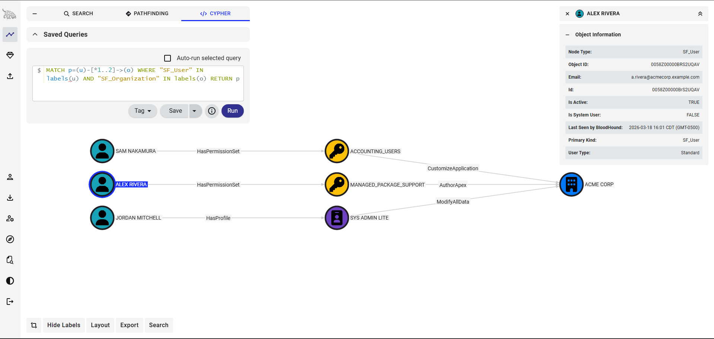

# ForceHound

[](https://github.com/NetSPI/ForceHound/actions/workflows/ci.yml)
[](https://www.python.org/downloads/)
[](LICENSE)

**Unified Salesforce BloodHound Collector**

ForceHound maps Salesforce identity, permission, and access-control structures into an attack-path graph compatible with [BloodHound Community Edition](https://github.com/BloodHoundAD/BloodHound). It outputs **OpenGraph v1** JSON that can be ingested by BloodHound CE to discover privilege-escalation paths, over-permissioned accounts, and hidden lateral-movement opportunities inside a Salesforce org.



Two collection backends are available and can be used independently or together:

| Backend | Auth Required | Library | Best For |
|---------|--------------|---------|----------|
| **API** (REST) | Admin session or username/password | `simple_salesforce` | Full org enumeration with Share objects |
| **Aura** (Lightning) | Browser session tokens | `aiohttp` | Low-privilege recon without admin access |

---

## Installation

```bash
# Clone and install in editable mode
cd ForceHound_v0.1
pip install -e .

# Or install from requirements.txt
pip install -r requirements.txt
```

**Requirements:** Python 3.9+

**Dependencies:**
- `simple-salesforce >= 1.12.0` — Salesforce REST API client
- `aiohttp >= 3.9.0` — Async HTTP for Aura endpoints
- `pytest >= 7.0` — Test framework *
- `pytest-asyncio >= 0.21` — Async test support *

\* Development/test dependencies only. Install with `pip install -e ".[dev]"`

---

## Quick Start: Data Collection

### Aura Mode (Low-Privilege)

Collect using Lightning Aura endpoints. Requires a browser session — no admin access needed.

```bash
python -m forcehound --collector aura \
    --instance-url https://myorg.lightning.force.com \
    --session-id "00DXX0000001234!AQEAQ..." \
    --aura-context '{"mode":"PRODDEBUG","fwuid":"...","app":"..."}' \
    --aura-token "eyJ..." \
    -o aura_output.json -v
```

### API Mode (Privileged)

Collect using the Salesforce REST API. Requires admin-level access.

```bash
# With session ID
python -m forcehound --collector api \
    --instance-url https://myorg.my.salesforce.com \
    --session-id "00DXX0000001234!AQEAQ..." \
    -o api_output.json -v

# With username/password
python -m forcehound --collector api \
    --instance-url https://myorg.my.salesforce.com \
    --username admin@myorg.com \
    --password "P@ssw0rd" \
    --security-token "aBcDeFgH" \
    -o api_output.json -v
```

### Both Mode (Merged)

Run both backends and merge results into a single graph. Produces the most complete picture.

```bash
python -m forcehound --collector both \
    --instance-url https://myorg.lightning.force.com \
    --session-id "00DXX0000001234!AQEAQ..." \
    --aura-context '{"mode":"PRODDEBUG","fwuid":"..."}' \
    --aura-token "eyJ..." \
    --api-instance-url https://myorg.my.salesforce.com \
    --api-session-id "00DXX0000001234!AQEAQ..." \
    -o both_output.json -v
```

Output is saved to the file specified by `-o` (default: `forcehound_output.json`).

---

## Quick Start: BloodHound Sync

Once you have a graph JSON file, upload it to BloodHound CE for visualization.

### One-Time Setup

```bash
# Register ForceHound's custom node types and icons in BloodHound CE
python -m forcehound --setup \
    --bh-token-id "your-token-uuid" \
    --bh-token-key "your-base64-key"
```

> **Note:** You need a running BloodHound CE instance. See [BloodHound CE setup instructions](https://github.com/BloodHoundAD/BloodHound) to install it on your localhost.

### Collect and Upload in One Step

```bash
python -m forcehound --collector aura \
    --instance-url https://myorg.lightning.force.com \
    --session-id "..." --aura-context "..." --aura-token "..." \
    --crud --audit-log 3 \
    --upload --clear-db \
    --bh-token-id "your-token-uuid" \
    --bh-token-key "your-base64-key"
```

### Useful Cypher Queries

Once data is ingested, open the BloodHound CE Cypher console and try these:

```cypher
-- All users with ModifyAllData (admin-equivalent)
MATCH (u:SF_User)-[:HasProfile|HasPermissionSet]->(e)-[:ModifyAllData]->(o:SF_Organization)
RETURN u.name, labels(e)[0], e.name

-- Shortest path from any user to ModifyAllData
MATCH p=shortestPath((u:SF_User)-[*1..5]->(o:SF_Organization))
WHERE ANY(r IN relationships(p) WHERE type(r) = 'ModifyAllData')
RETURN p

-- Users who can author Apex (remote code execution)
MATCH (u:SF_User)-[:HasProfile|HasPermissionSet]->(e)-[:AuthorApex]->(o:SF_Organization)
RETURN u.name, u.email, e.name

-- All CRUD-proven object access for the session user
MATCH (u:SF_User)-[r:CrudCanCreate|CrudCanRead|CrudCanEdit|CrudCanDelete]->(obj:SF_Object)
RETURN u.name, type(r), obj.name
```

---

## Proxying Traffic

Route all ForceHound traffic through an HTTP proxy (e.g., Burp Suite):

```bash
python -m forcehound --collector aura \
    --proxy http://127.0.0.1:8080 \
    ...
```

This applies to both the Aura (aiohttp) and API (simple_salesforce/requests) backends.

---

## Rate Limiting

Throttle requests to a maximum number per second:

```bash
python -m forcehound --collector aura \
    --rate-limit 5 \
    ...
```

---

## CRUD Probing

ForceHound can empirically test Create, Read, Edit, and Delete permissions by actually attempting DML operations against the org via Aura. This goes beyond metadata — it proves what the current session user can actually do.

See [`forcehound/collectors/crud/dummy_values.py`](forcehound/collectors/crud/dummy_values.py) for the sample values submitted during CRUD probing.

### Standard Mode

```bash
python -m forcehound --collector aura \
    --instance-url https://myorg.lightning.force.com \
    --session-id "..." --aura-context "..." --aura-token "..." \
    --crud -v
```

- **Read:** Enumerates records from every accessible object
- **Create:** Builds dummy records using intelligent field population (auto-resolves lookup references, respects picklists, handles required fields)
- **Edit:** No-op save/restore on one record per object
- **Delete:** Cleans up self-created records only (reverse dependency order)

### Aggressive Mode

```bash
python -m forcehound --collector aura \
    ... \
    --crud --aggressive -v
```

- **Edit:** Attempts a no-op save/restore on **every** record in every accessible object
- **Delete:** Deletes one random existing record per object (full pre-deletion snapshot saved to `forcehound_deletions_<timestamp>.json` for recovery)
- **Protected objects** (User, Profile, PermissionSet, ApexClass, etc.) are excluded from deletion by default

### Unsafe Mode

```bash
python -m forcehound --collector aura \
    ... \
    --crud --aggressive --unsafe -v
```

Allows delete-probing of protected identity/config objects. Even with `--unsafe`, only the self-created record is deleted — existing records of protected objects are never touched.

### Additional CRUD Options

```
--crud-objects Account,Contact   Only probe specific objects
--crud-dry-run                   Log plan without executing DML
--crud-concurrency 5             Max concurrent CRUD requests (default: 5)
--crud-max-records 10            Cap records tested per object in aggressive edit
```

### CRUD Edges

CRUD probing emits four additional edge kinds:

| Edge | Meaning |
|------|---------|
| `CrudCanCreate` | Session user can create records of this object |
| `CrudCanRead` | Session user can read records of this object |
| `CrudCanEdit` | Session user can edit records of this object |
| `CrudCanDelete` | Session user can delete records of this object |

### Protected Objects

The following objects are excluded from aggressive deletion (override with `--unsafe`):

**Identity & access control:** User, Profile, PermissionSet, PermissionSetGroup, PermissionSetGroupComponent, PermissionSetAssignment, Group, GroupMember, UserRole, Organization, CustomPermission, MutingPermissionSet

**Auth & integration:** ConnectedApplication, OauthToken, AuthProvider, NamedCredential

**Apex code:** ApexClass, ApexTrigger, ApexComponent, ApexPage

**Aura / LWC:** AuraDefinition, AuraDefinitionBundle

**Visualforce & UI:** StaticResource, FlexiPage

**Flows:** FlowDefinitionView, FlowRecord, FlowRecordVersion

**Audit & logging:** SetupAuditTrail, LoginHistory

---

## Audit Logging

ForceHound includes audit logging that records every HTTP interaction with the Salesforce org. Audit logs are written as JSONL (one JSON object per line) aligned with the [OCSF](https://schema.ocsf.io/) API Activity schema (class_uid 6003), enabling native ingestion by Splunk, Elastic, Microsoft Sentinel, AWS Security Lake, and other SIEM platforms.

```bash
python -m forcehound --collector aura \
    ... \
    --audit-log 3 -v
```

### Audit Levels

| Level | Content | Use Case |
|-------|---------|----------|
| **1** | Timestamp, operation, target resource, status code | Quick activity ledger |
| **2** | + HTTP headers, duration, error detail, response state | Operational debugging |
| **3** | + Full request body, full response body (no truncation) | Forensic reconstruction |

### Audit Log Structure

- **Session Start** — ForceHound version, collector type, CLI arguments, org metadata
- **Session User Resolved** — Confirmed session user identity (UID, name)
- **Per-request entries** — Sequentially numbered, one per HTTP request
- **Session End** — Total entry count, request count, file size

**Output:** `forcehound_audit_<timestamp>.jsonl`

> **Warning:** Level 3 logs contain the full session ID in request headers. Treat audit log files as credential artifacts.

---

## CLI Reference

### Connection

```
--collector {api,aura,both}    Collection backend (default: aura)
--instance-url URL             Salesforce instance URL
--session-id TOKEN             Session ID / access token
--username USER                Salesforce username (API mode)
--password PASS                Salesforce password (API mode)
--security-token TOKEN         Security token (API mode)
--aura-context JSON            Aura context JSON string
--aura-token JWT               Aura token JWT string
--api-instance-url URL         API instance URL for 'both' mode
--api-session-id TOKEN         API session ID for 'both' mode
```

### Output

```
-o, --output FILE              Output path (default: forcehound_output.json)
-v, --verbose                  Show detailed progress and kind breakdowns
--risk-summary                 Print per-user risk summary with capabilities
```

### Network

```
--proxy URL                    HTTP/HTTPS proxy (e.g., http://127.0.0.1:8080)
--rate-limit REQ/S             Max requests per second (e.g., 5)
```

### Aura Tuning

```
--max-workers N                Concurrent Aura requests (default: 30)
--page-size N                  GraphQL page size (default: 2000)
--active-only                  Only collect active users (Aura mode)
--aura-path PATH               Aura endpoint path (default: /aura)
```

### CRUD Probing

```
--crud                         Enable empirical CRUD permission testing
--aggressive                   Edit all records, delete one existing per object
--unsafe                       Allow delete-probing of protected objects
                               (requires --aggressive)
--crud-objects LIST            Comma-separated object names to probe
--crud-dry-run                 Log plan without executing DML
--crud-concurrency N           Max concurrent CRUD requests (default: 5)
--crud-max-records N           Cap records tested per object (aggressive edit)
```

### Audit Logging

```
--audit-log {1,2,3}            Enable audit logging at specified level
```

### BloodHound CE

```
--bh-url URL                   BH CE base URL (default: http://localhost:8080)
--bh-token-id UUID             BH API token ID
--bh-token-key SECRET          BH API token key (base64-encoded)
--upload                       Auto-upload output to BH CE after collection
--upload-file-name NAME        Display name for the uploaded file in BH CE
--clear-db                     Clear BH database before uploading
--clear-db-only                Clear BH database and exit (no collection)
--setup                        Register custom node types/icons and exit
--wait SECONDS                 Delay after DB clear before upload (default: 60)
```

### Collection Scope

```
--skip-object-permissions      Skip CRUD/ObjectPermissions collection
--skip-shares                  Skip Share-object discovery and queries
--skip-field-permissions       Skip FieldPermissions (FLS) collection
--skip-entity-definitions      Skip EntityDefinition metadata
```

### Environment Variables

All connection parameters have environment variable fallbacks, checked when CLI flags are omitted:

| Variable | CLI Flag |
|----------|----------|
| `FORCEHOUND_INSTANCE_URL` | `--instance-url` |
| `FORCEHOUND_SESSION_ID` | `--session-id` |
| `FORCEHOUND_USERNAME` | `--username` |
| `FORCEHOUND_PASSWORD` | `--password` |
| `FORCEHOUND_SECURITY_TOKEN` | `--security-token` |
| `FORCEHOUND_AURA_CONTEXT` | `--aura-context` |
| `FORCEHOUND_AURA_TOKEN` | `--aura-token` |
| `FORCEHOUND_API_INSTANCE_URL` | `--api-instance-url` |
| `FORCEHOUND_API_SESSION_ID` | `--api-session-id` |
| `FORCEHOUND_BH_URL` | `--bh-url` |
| `FORCEHOUND_BH_TOKEN_ID` | `--bh-token-id` |
| `FORCEHOUND_BH_TOKEN_KEY` | `--bh-token-key` |
| `FORCEHOUND_PROXY` | `--proxy` |
| `FORCEHOUND_RATE_LIMIT` | `--rate-limit` |

---

## Obtaining Aura Tokens

To use the Aura backend, you need three values from a browser session:

1. **Instance URL** — The Lightning domain (e.g., `https://myorg.lightning.force.com`)
2. **Session ID** — The `sid` cookie value
3. **Aura Context & Token** — Extracted from network traffic

### Steps

1. Log in to Salesforce Lightning in your browser.
2. Open **Developer Tools** (F12) > **Network** tab.
3. Filter requests for `aura` in the URL.
4. Find any POST request to `/aura` and inspect the **Form Data**:
   - `aura.context` — Copy the full JSON string (starts with `{"mode":...}`)
   - `aura.token` — Copy the JWT token (starts with `eyJ...`)
5. For the session ID, check **Application** > **Cookies** > look for `sid`.

> **Tip:** The `aura.context` may be URL-encoded in the browser. ForceHound automatically detects and decodes URL-encoded values.

---

## Output Format

ForceHound outputs **OpenGraph v1** JSON with `metadata.source_kind: "Salesforce"`, which enables source-kind-based Cypher queries in BloodHound CE (e.g., `MATCH (n:Salesforce) RETURN n`).

```json
{
  "metadata": {
    "source_kind": "Salesforce"
  },
  "graph": {
    "nodes": [
      {
        "id": "005XX0000001ATEAAA",
        "kinds": ["SF_User", "User"],
        "properties": {
          "name": "Admin User",
          "email": "admin@example.com",
          "is_active": true,
          "objectid": "005XX0000001ATEAAA"
        }
      }
    ],
    "edges": [
      {
        "start": {"value": "005XX0000001ATEAAA", "match_by": "id"},
        "end": {"value": "00eXX000000PROF1", "match_by": "id"},
        "kind": "HasProfile"
      }
    ]
  }
}
```

All Salesforce IDs use the 18-character case-insensitive format.

---

## Graph Model

### Node Kinds

| Kind | Source | Description |
|------|--------|-------------|
| `SF_User` | Both | Salesforce user account |
| `SF_Profile` | Both | Profile (permission container) |
| `SF_PermissionSet` | Both | Permission set (also used for PSGs) |
| `SF_Role` | Both | Role in the role hierarchy |
| `SF_PublicGroup` | Both | Public group |
| `SF_Group` | Both | Group (includes queues) |
| `SF_Organization` | Both | The Salesforce org itself |
| `SF_Object` | Both | Standard/custom Salesforce object |
| `SF_Field` | API | Object field (field-level security) |
| `SF_Record` | API | Shared record (from Share objects) |
| `SF_NamespacedObject` | Aura | Managed-package custom object |
| `SF_ConnectedApp` | API | Connected/OAuth application |

### Edge Kinds

**Identity & Assignment:**

| Edge | Meaning |
|------|---------|
| `HasProfile` | User > Profile assignment |
| `HasRole` | User > Role assignment |
| `HasPermissionSet` | User > PermissionSet assignment |
| `IncludedIn` | PermissionSet > PermissionSetGroup membership |

**Hierarchy & Membership:**

| Edge | Meaning |
|------|---------|
| `ReportsTo` | Child Role > Parent Role hierarchy |
| `ManagedBy` | User > Manager relationship |
| `MemberOf` | User > Group membership |
| `Contains` | Group > nested Group containment |

**Access & Sharing:**

| Edge | Meaning |
|------|---------|
| `CanAccess` | User > NamespacedObject access |
| `CanAccessApp` | User > ConnectedApp access |
| `Owns` | User/Group > Record ownership |
| `ExplicitAccess` | User/Group > Record explicit sharing |
| `InheritsAccess` | Child > Parent record inheritance |

**Capability Edges (15):**

`ModifyAllData`, `ViewAllData`, `AuthorApex`, `ManageUsers`, `CustomizeApplication`, `ManageProfilesPermissionsets`, `AssignPermissionSets`, `ManageRoles`, `ManageSharing`, `ManageInternalUsers`, `ResetPasswords`, `ApiEnabled`, `ViewSetup`, `ViewAllUsers`, `ManageDataIntegrations`

**Object CRUD Edges (7, from ObjectPermissions metadata):**

`CanCreate`, `CanRead`, `CanEdit`, `CanDelete`, `CanViewAll`, `CanModifyAll`, `CanViewAllFields`

**Field-Level Security Edges (3):**

`CanReadField`, `CanEditField`, `FieldOf`

**CRUD Probe Edges (4, from empirical testing):**

`CrudCanCreate`, `CrudCanRead`, `CrudCanEdit`, `CrudCanDelete`

---

## Architecture

```
forcehound/
├── __init__.py
├── __main__.py
├── cli.py                        # Unified CLI entry point
├── constants.py                  # Enums, capability maps, kind registries
├── audit.py                      # OCSF-aligned audit logging
├── models/
│   ├── base.py                   # GraphNode, GraphEdge, CollectionResult
│   ├── auth.py                   # AuthConfig with validation
│   └── api_models.py             # Typed SOQL result dataclasses
├── collectors/
│   ├── base.py                   # Abstract BaseCollector
│   ├── api_collector.py          # REST API collector (20+ SOQL queries)
│   ├── api_query_utils.py        # Shared audit-aware SOQL query helper
│   ├── api_share_collector.py    # Share object sub-collector
│   ├── aura_collector.py         # Aura collector (11-step async flow)
│   ├── aura/
│   │   └── client.py             # Async Aura HTTP client (9 actions)
│   └── crud/
│       ├── prober.py             # CRUD probe orchestrator
│       ├── dummy_values.py       # Intelligent dummy value generation
│       └── lookup_cache.py       # Reference resolution & dependency ordering
├── bloodhound/
│   └── client.py                 # BH CE API client (stdlib-only, HMAC auth)
├── graph/
│   └── builder.py                # Graph builder with merge/dedup
└── utils/
    ├── id_utils.py               # SF ID conversion, hash-based IDs
    └── rate_limiter.py           # Exponential backoff decorator
```

---

## Disclosure

Development of this tool was assisted by LLM coding assistants. As with any open-source tool, review the code to understand what it does before running it. The code has been reviewed and tested for correctness and potential issues.

---

## License

BSD-3-Clause. This project is intended for authorized security testing, penetration testing engagements, and defensive security research only. Always obtain proper authorization before collecting data from any Salesforce organization.
